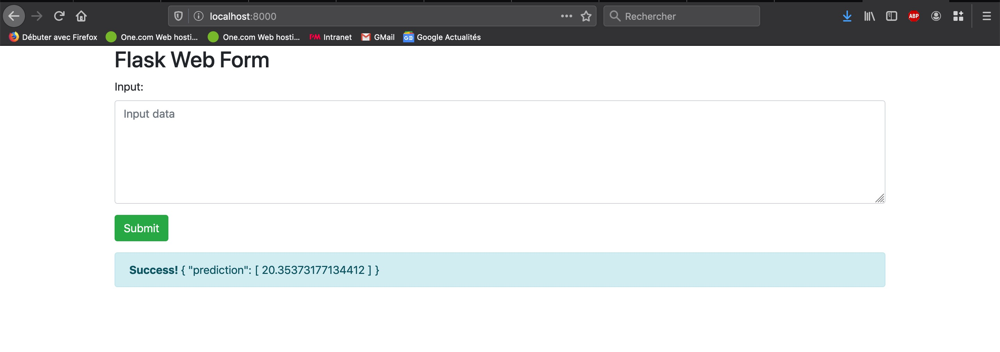
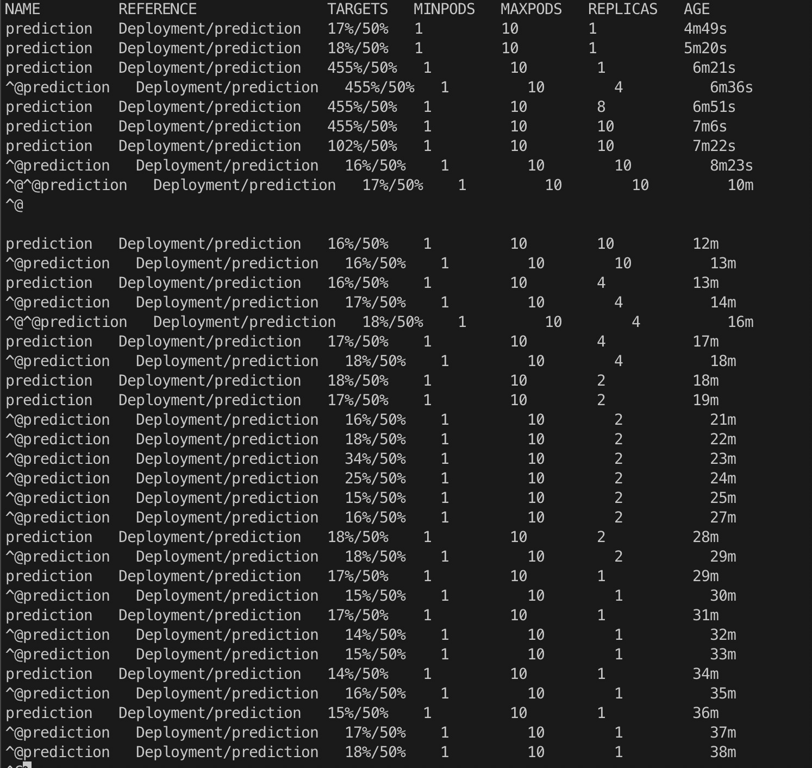

[](https://app.circleci.com/pipelines/github/Adriks976/udacity-Project4)

# Operationalize a Machine Learning Microservice API

## Introduction

This repository is part of my Udacity devops nano degree journey!

You will find in this readme the project overview and tasks (given by Udacity) and all steps to setup deploy and test this project.

## Project Overview

In this project, you will apply the skills you have acquired in this course to operationalize a Machine Learning Microservice API. 

You are given a pre-trained, `sklearn` model that has been trained to predict housing prices in Boston according to several features, such as average rooms in a home and data about highway access, teacher-to-pupil ratios, and so on. You can read more about the data, which was initially taken from Kaggle, on [the data source site](https://www.kaggle.com/c/boston-housing). This project tests your ability to operationalize a Python flask app—in a provided file, `app.py`—that serves out predictions (inference) about housing prices through API calls. This project could be extended to any pre-trained machine learning model, such as those for image recognition and data labeling.

### Project Tasks

Your project goal is to operationalize this working, machine learning microservice using [kubernetes](https://kubernetes.io/), which is an open-source system for automating the management of containerized applications. In this project you will:
* Test your project code using linting
* Complete a Dockerfile to containerize this application
* Deploy your containerized application using Docker and make a prediction
* Improve the log statements in the source code for this application
* Configure Kubernetes and create a Kubernetes cluster
* Deploy a container using Kubernetes and make a prediction
* Upload a complete Github repo with CircleCI to indicate that your code has been tested

You can find a detailed [project rubric, here](https://review.udacity.com/#!/rubrics/2576/view).

**The final implementation of the project will showcase your abilities to operationalize production microservices.**

---

## Setup the Environment

It's better to create a virtualenv and activate it:

To do so:

`make install` 

then run `make install` to install the necessary dependencies

## Running `app.py`

You can run in different ways this app: standalone, Docker and Kubernetes

### Standalone:  `python app.py`

You can now access the app on localhost port 80. [http://localhost:80](http://localhost:80)

### Run in Docker:  `./run_docker.sh` or `make run_docker`

This script will:
- Build an image
- List images to verify that this app is dockerized
- Run a container with this specified image and map port 8000 (host) to 80 (container)

You can now access the app on localhost port 8000. [http://localhost:8000](http://localhost:8000)

### Run in Kubernetes:  `./run_kubernetes.sh` or via deployment file

#### `./run_kubernetes.sh`: 

This script will:
- Start to run a container in Kubernetes cluster (make sure to have one ready)
- Wait for the pod to be running
- List pod to verify your pod is up
- Forward port 8000 (host) to 80 (container)

You can now access the app on localhost port 8000. [http://localhost:8000](http://localhost:8000)

You can delete when you've finished the pod with the command `kubectl delete pod prediction`

#### deployment file

In this repository you'll find a yaml file [kubernetes-prediction.yml](kubernetes-prediction.yml)

with the command `kubectl apply -f kubernetes-prediction.yml` you will create 3 kubernetes resources:

- deployment
- service
- hpa

then run `kubectl port-forward svc/prediction 8000:80`

You can now access the app on localhost port 8000. [http://localhost:8000](http://localhost:8000)

You can delete when you've finished by running the command `kubectl delete -f kubernetes-prediction.yml`

## Test the application

You can test this application by running the script `./make_prediction.sh`

By default this script will post a json:

```json
{  
   "CHAS":{  
      "0":0
   },
   "RM":{  
      "0":6.575
   },
   "TAX":{  
      "0":296.0
   },
   "PTRATIO":{  
      "0":15.3
   },
   "B":{  
      "0":396.9
   },
   "LSTAT":{  
      "0":4.98
   }
}
```

with curl on port 8000 (you can switch to 80 if running on standalone)

Also, when accessing the app, you will notice that a simple front end has been setup to allow user to input their json.

You can also try this way.



## Load Tests

You can run load tests with Locust (installed as a requirement)

```bash
locust --host=http://localhost:8000
```

where host is the endpoint of the app.

You can navigate to locust endpoint on locahost port 8089 [http://localhost:8089](http://localhost:8089)

And start load testing!

## Demo Scaling on Kubernetes

Cool part, if you want to try Kubernetes Horizontal Pod Autoscaler you can do so!

With Locust and Kubernetes (via deployment file)

Here is a video showing my scaling from 1 to 10 pods for my app.

[](https://youtu.be/CKXkw0zTlk4)

You can also go in demo folder and find the video.


And a screenshot showing all the steps from scale up to scale down.

